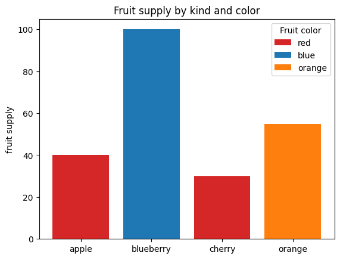

nbdev-hello
================

<!-- WARNING: THIS FILE WAS AUTOGENERATED! DO NOT EDIT! -->

``` python
from nbdev_hello.core import *
from nbdev_hello.book import *
```

This file will become your README and also the index of your
documentation.

## Install

``` sh
pip install nbdev_hello
```

## How to use

Fill me in please! Don’t forget code examples:

``` python
1+1
```

    2

## Addition to see cleaning for git

``` python
print("New line above original line!")
```

    New line above original line!

``` python
print("This is a new line!")
```

    This is a new line!

## Test git diffs for plots

``` python
import matplotlib.pyplot as plt
```

``` python
fig, ax = plt.subplots()

fruits = ['apple', 'blueberry', 'cherry', 'orange']
counts = [40, 100, 30, 55]
bar_labels = ['red', 'blue', '_red', 'orange']
bar_colors = ['tab:red', 'tab:blue', 'tab:red', 'tab:orange']

ax.bar(fruits, counts, label=bar_labels, color=bar_colors)

ax.set_ylabel('fruit supply')
ax.set_title('Fruit supply by kind and color')
ax.legend(title='Fruit color')

plt.show()
```



%nbdev_hide \## This is a new
sectionf98f9f00897fa17180b902945abda87d77153938f98f9f00897fa17180b902945abda87d77153938

## My Book class

``` python
b = Book("naslov", "avtor")
```

------------------------------------------------------------------------

<a
href="https://github.com/anasbraj/nbdev-hello/blob/main/nbdev_hello/book.py#LNone"
target="_blank" style="float:right; font-size:smaller">source</a>

### Book

>      Book (title, author)

Class representation of book

|        | **Details**       |
|--------|-------------------|
| title  | title of the book |
| author | book’s author     |
